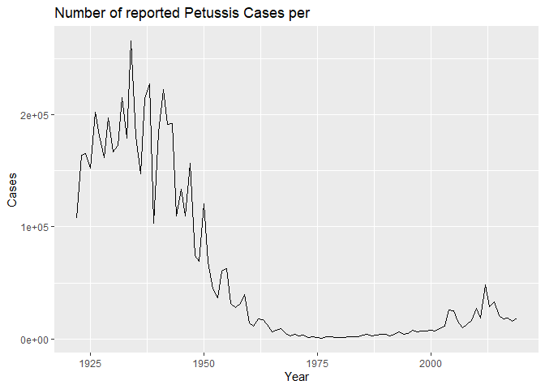
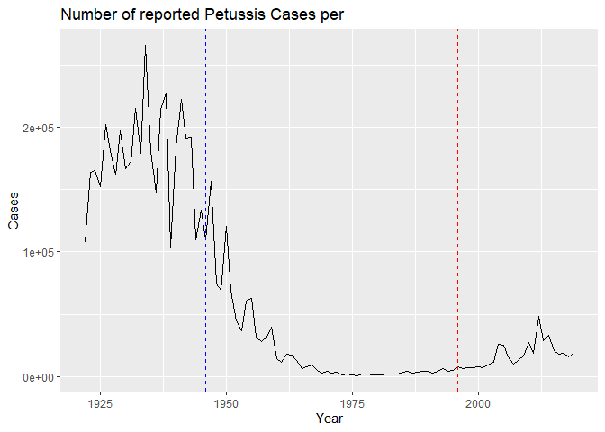
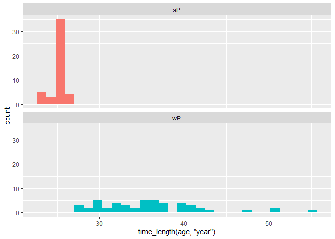
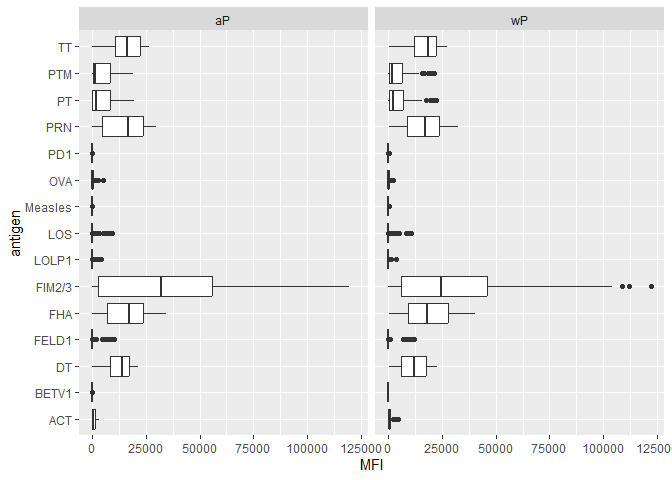
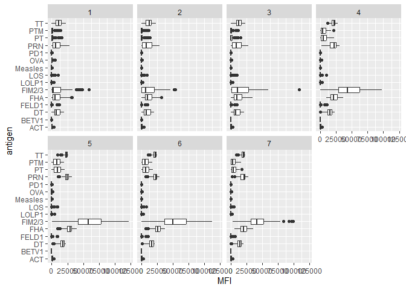

Class19 Mini Project: Investigating Pertussis Resurgence
================
Vincent Chau

## Investigating pertussis cases by year

``` r
cdc <- data.frame(
                                 Year = c(1922L,1923L,1924L,1925L,
                                          1926L,1927L,1928L,1929L,1930L,1931L,
                                          1932L,1933L,1934L,1935L,1936L,
                                          1937L,1938L,1939L,1940L,1941L,1942L,
                                          1943L,1944L,1945L,1946L,1947L,
                                          1948L,1949L,1950L,1951L,1952L,
                                          1953L,1954L,1955L,1956L,1957L,1958L,
                                          1959L,1960L,1961L,1962L,1963L,
                                          1964L,1965L,1966L,1967L,1968L,1969L,
                                          1970L,1971L,1972L,1973L,1974L,
                                          1975L,1976L,1977L,1978L,1979L,1980L,
                                          1981L,1982L,1983L,1984L,1985L,
                                          1986L,1987L,1988L,1989L,1990L,
                                          1991L,1992L,1993L,1994L,1995L,1996L,
                                          1997L,1998L,1999L,2000L,2001L,
                                          2002L,2003L,2004L,2005L,2006L,2007L,
                                          2008L,2009L,2010L,2011L,2012L,
                                          2013L,2014L,2015L,2016L,2017L,2018L,
                                          2019L),
         Cases = c(107473,164191,165418,152003,
                                          202210,181411,161799,197371,
                                          166914,172559,215343,179135,265269,
                                          180518,147237,214652,227319,103188,
                                          183866,222202,191383,191890,109873,
                                          133792,109860,156517,74715,69479,
                                          120718,68687,45030,37129,60886,
                                          62786,31732,28295,32148,40005,
                                          14809,11468,17749,17135,13005,6799,
                                          7717,9718,4810,3285,4249,3036,
                                          3287,1759,2402,1738,1010,2177,2063,
                                          1623,1730,1248,1895,2463,2276,
                                          3589,4195,2823,3450,4157,4570,
                                          2719,4083,6586,4617,5137,7796,6564,
                                          7405,7298,7867,7580,9771,11647,
                                          25827,25616,15632,10454,13278,
                                          16858,27550,18719,48277,28639,32971,
                                          20762,17972,18975,15609,18617)
       )
```

Make a plot of the number of Pertussis cases per year from this CDC data
to investigate

> Q1. With the help of the R “addin” package datapasta assign the CDC
> pertussis case number data to a data frame called cdc and use ggplot
> to make a plot of cases numbers over time.

``` r
library(datapasta)
```

    Warning: package 'datapasta' was built under R version 4.2.2

``` r
library(ggplot2)
```

    Warning: package 'ggplot2' was built under R version 4.2.2

``` r
baseplot <- ggplot(cdc) +
  aes(x=Year, y=Cases) +
  geom_line() +
  labs(title = "Number of reported Petussis Cases per ")
baseplot
```



> Q2. Using the ggplot geom_vline() function add lines to your previous
> plot for the 1946 introduction of the wP vaccine and the 1996 switch
> to aP vaccine (see example in the hint below). What do you notice?

``` r
baseplot + geom_vline(xintercept = 1946, linetype=2, color="blue") + geom_vline(xintercept = 1996, linetype=2, color="red")
```



> Q3. Describe what happened after the introduction of the aP vaccine?
> Do you have a possible explanation for the observed trend?

It is clear from the CDC data that pertussis cases are once again
increasing. For example, we can see that in 2012 the CDC reported 48,277
cases of pertussis in the United States. This is the largest number of
cases reported since 1955, when 62,786 cases were reported. The
pertussis field has several hypotheses for the resurgence of pertussis
including (in no particular order): 1) more sensitive PCR-based testing,
2) vaccination hesitancy 3) bacterial evolution (escape from vaccine
immunity), 4) waning of immunity in adolescents originally primed as
infants with the newer aP vaccine as compared to the older wP vaccine.

## Getting Data from CMI-PB

The CMI-PB resource is studying and making available data on the immune
response to Petussis vaccination.

It mostly returns JSON format data that we need to process and conert
into something useable in R.

``` r
# Allows us to read, write and process JSON data
library(jsonlite)
```

    Warning: package 'jsonlite' was built under R version 4.2.2

``` r
subject <- read_json("https://www.cmi-pb.org/api/subject", simplifyVector = TRUE)
```

``` r
head(subject, 3)
```

      subject_id infancy_vac biological_sex              ethnicity  race
    1          1          wP         Female Not Hispanic or Latino White
    2          2          wP         Female Not Hispanic or Latino White
    3          3          wP         Female                Unknown White
      year_of_birth date_of_boost      dataset
    1    1986-01-01    2016-09-12 2020_dataset
    2    1968-01-01    2019-01-28 2020_dataset
    3    1983-01-01    2016-10-10 2020_dataset

> Q4. How may aP and wP infancy vaccinated subjects are in the dataset?

``` r
table(subject$infancy_vac)
```


    aP wP 
    47 49 

> Q5. How many Male and Female subjects/patients are in the dataset?

``` r
table(subject$biological_sex)
```


    Female   Male 
        66     30 

> Q6. What is the breakdown of race and biological sex (e.g. number of
> Asian females, White males etc…)?

``` r
table(subject$race, subject$biological_sex)
```

                                               
                                                Female Male
      American Indian/Alaska Native                  0    1
      Asian                                         18    9
      Black or African American                      2    0
      More Than One Race                             8    2
      Native Hawaiian or Other Pacific Islander      1    1
      Unknown or Not Reported                       10    4
      White                                         27   13

## Side-Note: Working with dates

To help ease the pain of working with dates we can use
`library(lubridate)`.

``` r
library(lubridate)
```

    Warning: package 'lubridate' was built under R version 4.2.2

    Loading required package: timechange

    Warning: package 'timechange' was built under R version 4.2.2


    Attaching package: 'lubridate'

    The following objects are masked from 'package:base':

        date, intersect, setdiff, union

``` r
today()
```

    [1] "2022-12-04"

How many days have passed since new year 2000

``` r
today() - ymd("2000-01-01")
```

    Time difference of 8373 days

What is this in years?

``` r
time_length( today() - ymd("2000-01-01"),  "years")
```

    [1] 22.92402

> Q7. Using this approach determine (i) the average age of wP
> individuals, (ii) the average age of aP individuals; and (iii) are
> they significantly different?

``` r
subject$age <- today() - ymd(subject$year_of_birth)
subject$age
```

    Time differences in days
     [1] 13486 20061 14582 12756 11660 12756 15312 13851  9834 14947 13486 14947
    [13]  9468 10929 12390 13121 15678  9468 10564 13121 10929 10199 10929 12025
    [25] 17139 18600 18600 12025  9103  9103 11660 10199 10199  9103  9103 12756
    [37] 10929 13121 11295 10929  9103  8738  9468  8373  9103  8373  8373  9468
    [49]  8738  9103  8373  9834  8738  9103  8373 15312 14582 13851 11660 11295
    [61] 12756 14582  9468 14947  9468 12756 12390  9468 12025 14582 11660  9468
    [73]  9103  9468 13851 10564 13851  9468  9103  9103  9468  9103  9834  9103
    [85]  9468  9468  9468  9103  9103  9468  9468  9468  9834  9468  9468  9468

Now we can select or filter for “aP” and find the average age - convert
into years.

``` r
library(dplyr)
```

    Warning: package 'dplyr' was built under R version 4.2.2


    Attaching package: 'dplyr'

    The following objects are masked from 'package:stats':

        filter, lag

    The following objects are masked from 'package:base':

        intersect, setdiff, setequal, union

``` r
ap <- subject %>% filter(infancy_vac == "aP")
round( summary( time_length( ap$age, "years")))
```

       Min. 1st Qu.  Median    Mean 3rd Qu.    Max. 
         23      25      26      25      26      27 

``` r
wp <- subject %>% filter(infancy_vac == "wP") 
summary(time_length(wp$age, "years"))
```

       Min. 1st Qu.  Median    Mean 3rd Qu.    Max. 
      27.92   31.92   34.92   36.09   39.92   54.92 

> Q8. Determine the age of all individuals at time of boost?

``` r
int <- ymd(subject$date_of_boost) - ymd(subject$year_of_birth)
age_at_boost <- time_length(int, "year")
head(age_at_boost)
```

    [1] 30.69678 51.07461 33.77413 28.65982 25.65914 28.77481

> Q9. With the help of a faceted boxplot (see below), do you think these
> two groups are significantly different?

``` r
ggplot(subject) +
  aes(time_length(age, "year"),
      fill=as.factor(infancy_vac)) +
  geom_histogram(show.legend=FALSE) +
  facet_wrap(vars(infancy_vac), nrow=2)
```

    `stat_bin()` using `bins = 30`. Pick better value with `binwidth`.



## Joining multiple tables

## Ab titer data

``` r
# Complete the API URLs...
specimen <- read_json("https://www.cmi-pb.org/api//specimen", simplifyVector = TRUE) 
titer <- read_json("https://www.cmi-pb.org/api/ab_titer", simplifyVector = TRUE) 
```

Quick peak at the start of this specimen data

``` r
head(specimen)
```

      specimen_id subject_id actual_day_relative_to_boost
    1           1          1                           -3
    2           2          1                          736
    3           3          1                            1
    4           4          1                            3
    5           5          1                            7
    6           6          1                           11
      planned_day_relative_to_boost specimen_type visit
    1                             0         Blood     1
    2                           736         Blood    10
    3                             1         Blood     2
    4                             3         Blood     3
    5                             7         Blood     4
    6                            14         Blood     5

> Q9. Complete the code to join \``specimen` and `subject` tables to
> make a new merged data frame containing all specimen records along
> with their associated subject details:

``` r
meta <- inner_join(specimen, subject)
```

    Joining, by = "subject_id"

``` r
dim(meta)
```

    [1] 729  14

``` r
head(meta)
```

      specimen_id subject_id actual_day_relative_to_boost
    1           1          1                           -3
    2           2          1                          736
    3           3          1                            1
    4           4          1                            3
    5           5          1                            7
    6           6          1                           11
      planned_day_relative_to_boost specimen_type visit infancy_vac biological_sex
    1                             0         Blood     1          wP         Female
    2                           736         Blood    10          wP         Female
    3                             1         Blood     2          wP         Female
    4                             3         Blood     3          wP         Female
    5                             7         Blood     4          wP         Female
    6                            14         Blood     5          wP         Female
                   ethnicity  race year_of_birth date_of_boost      dataset
    1 Not Hispanic or Latino White    1986-01-01    2016-09-12 2020_dataset
    2 Not Hispanic or Latino White    1986-01-01    2016-09-12 2020_dataset
    3 Not Hispanic or Latino White    1986-01-01    2016-09-12 2020_dataset
    4 Not Hispanic or Latino White    1986-01-01    2016-09-12 2020_dataset
    5 Not Hispanic or Latino White    1986-01-01    2016-09-12 2020_dataset
    6 Not Hispanic or Latino White    1986-01-01    2016-09-12 2020_dataset
             age
    1 13486 days
    2 13486 days
    3 13486 days
    4 13486 days
    5 13486 days
    6 13486 days

``` r
dim(subject)
```

    [1] 96  9

> Q10. Now using the same procedure join meta with titer data so we can
> further analyze this data in terms of time of visit aP/wP, male/female
> etc.

``` r
abdata <- inner_join(titer, meta)
```

    Joining, by = "specimen_id"

``` r
dim(abdata)
```

    [1] 32675    21

> Q11. How many specimens (i.e. entries in abdata) do we have for each
> isotype?

``` r
table(abdata$isotype)
```


     IgE  IgG IgG1 IgG2 IgG3 IgG4 
    6698 1413 6141 6141 6141 6141 

> Q12. What do you notice about the number of visit 8 specimens compared
> to other visits?

``` r
table(abdata$visit)
```


       1    2    3    4    5    6    7    8 
    5795 4640 4640 4640 4640 4320 3920   80 

## Examine IgG1 Ab titer levels

Exclude the small number of visit 8 entries.

``` r
ig1 <- abdata %>% filter(isotype == "IgG1", visit!=8)
head(ig1)
```

      specimen_id isotype is_antigen_specific antigen        MFI MFI_normalised
    1           1    IgG1                TRUE     ACT 274.355068      0.6928058
    2           1    IgG1                TRUE     LOS  10.974026      2.1645083
    3           1    IgG1                TRUE   FELD1   1.448796      0.8080941
    4           1    IgG1                TRUE   BETV1   0.100000      1.0000000
    5           1    IgG1                TRUE   LOLP1   0.100000      1.0000000
    6           1    IgG1                TRUE Measles  36.277417      1.6638332
       unit lower_limit_of_detection subject_id actual_day_relative_to_boost
    1 IU/ML                 3.848750          1                           -3
    2 IU/ML                 4.357917          1                           -3
    3 IU/ML                 2.699944          1                           -3
    4 IU/ML                 1.734784          1                           -3
    5 IU/ML                 2.550606          1                           -3
    6 IU/ML                 4.438966          1                           -3
      planned_day_relative_to_boost specimen_type visit infancy_vac biological_sex
    1                             0         Blood     1          wP         Female
    2                             0         Blood     1          wP         Female
    3                             0         Blood     1          wP         Female
    4                             0         Blood     1          wP         Female
    5                             0         Blood     1          wP         Female
    6                             0         Blood     1          wP         Female
                   ethnicity  race year_of_birth date_of_boost      dataset
    1 Not Hispanic or Latino White    1986-01-01    2016-09-12 2020_dataset
    2 Not Hispanic or Latino White    1986-01-01    2016-09-12 2020_dataset
    3 Not Hispanic or Latino White    1986-01-01    2016-09-12 2020_dataset
    4 Not Hispanic or Latino White    1986-01-01    2016-09-12 2020_dataset
    5 Not Hispanic or Latino White    1986-01-01    2016-09-12 2020_dataset
    6 Not Hispanic or Latino White    1986-01-01    2016-09-12 2020_dataset
             age
    1 13486 days
    2 13486 days
    3 13486 days
    4 13486 days
    5 13486 days
    6 13486 days

> Q13. Complete the following code to make a summary boxplot of Ab titer
> levels for all antigens:

Make a summary plot of antigen levels.

``` r
ggplot(ig1) + 
  aes(MFI, antigen) +
  geom_boxplot()
```


``` r
# facet by aP or wP
```

``` r
ggplot(ig1) +
  aes(MFI, antigen) +
  geom_boxplot() +
  facet_wrap(vars(infancy_vac))
```



How do these change over time - one viz that may be helpful is to facet
the adobe plot by visit number.

``` r
ggplot(ig1) + 
  aes(MFI, antigen) +
  geom_boxplot()+
  facet_wrap(vars(visit), nrow=2)
```


