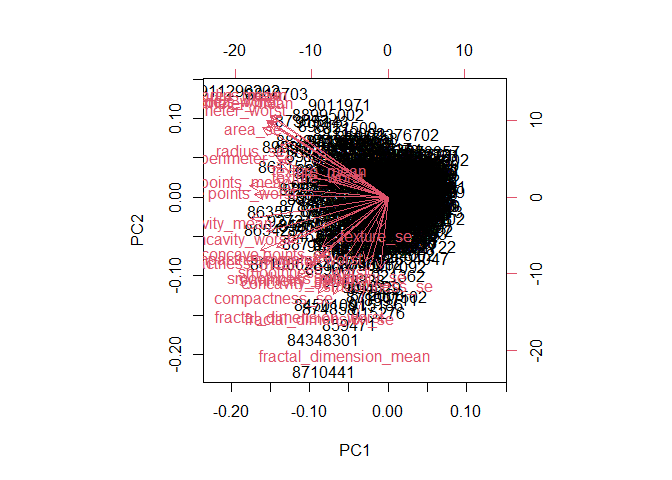

Class 8 Mini-Project
================
Vincent Chau

# Preparing the data

``` r
library(readr)
WisconsinCancer <- read_csv("WisconsinCancer.csv")
```

    Rows: 569 Columns: 32
    ── Column specification ────────────────────────────────────────────────────────
    Delimiter: ","
    chr  (1): diagnosis
    dbl (31): id, radius_mean, texture_mean, perimeter_mean, area_mean, smoothne...

    ℹ Use `spec()` to retrieve the full column specification for this data.
    ℹ Specify the column types or set `show_col_types = FALSE` to quiet this message.

``` r
View(WisconsinCancer)
```

``` r
# Save your input data file into your Project directory

fna.data <- "WisconsinCancer.csv"

#Complete the following code to input the data and store as wisc.df

wisc.df <- WisconsinCancer
str(wisc.df)
```

    spc_tbl_ [569 × 32] (S3: spec_tbl_df/tbl_df/tbl/data.frame)
     $ id                     : num [1:569] 842302 842517 84300903 84348301 84358402 ...
     $ diagnosis              : chr [1:569] "M" "M" "M" "M" ...
     $ radius_mean            : num [1:569] 18 20.6 19.7 11.4 20.3 ...
     $ texture_mean           : num [1:569] 10.4 17.8 21.2 20.4 14.3 ...
     $ perimeter_mean         : num [1:569] 122.8 132.9 130 77.6 135.1 ...
     $ area_mean              : num [1:569] 1001 1326 1203 386 1297 ...
     $ smoothness_mean        : num [1:569] 0.1184 0.0847 0.1096 0.1425 0.1003 ...
     $ compactness_mean       : num [1:569] 0.2776 0.0786 0.1599 0.2839 0.1328 ...
     $ concavity_mean         : num [1:569] 0.3001 0.0869 0.1974 0.2414 0.198 ...
     $ concave points_mean    : num [1:569] 0.1471 0.0702 0.1279 0.1052 0.1043 ...
     $ symmetry_mean          : num [1:569] 0.242 0.181 0.207 0.26 0.181 ...
     $ fractal_dimension_mean : num [1:569] 0.0787 0.0567 0.06 0.0974 0.0588 ...
     $ radius_se              : num [1:569] 1.095 0.543 0.746 0.496 0.757 ...
     $ texture_se             : num [1:569] 0.905 0.734 0.787 1.156 0.781 ...
     $ perimeter_se           : num [1:569] 8.59 3.4 4.58 3.44 5.44 ...
     $ area_se                : num [1:569] 153.4 74.1 94 27.2 94.4 ...
     $ smoothness_se          : num [1:569] 0.0064 0.00522 0.00615 0.00911 0.01149 ...
     $ compactness_se         : num [1:569] 0.049 0.0131 0.0401 0.0746 0.0246 ...
     $ concavity_se           : num [1:569] 0.0537 0.0186 0.0383 0.0566 0.0569 ...
     $ concave points_se      : num [1:569] 0.0159 0.0134 0.0206 0.0187 0.0188 ...
     $ symmetry_se            : num [1:569] 0.03 0.0139 0.0225 0.0596 0.0176 ...
     $ fractal_dimension_se   : num [1:569] 0.00619 0.00353 0.00457 0.00921 0.00511 ...
     $ radius_worst           : num [1:569] 25.4 25 23.6 14.9 22.5 ...
     $ texture_worst          : num [1:569] 17.3 23.4 25.5 26.5 16.7 ...
     $ perimeter_worst        : num [1:569] 184.6 158.8 152.5 98.9 152.2 ...
     $ area_worst             : num [1:569] 2019 1956 1709 568 1575 ...
     $ smoothness_worst       : num [1:569] 0.162 0.124 0.144 0.21 0.137 ...
     $ compactness_worst      : num [1:569] 0.666 0.187 0.424 0.866 0.205 ...
     $ concavity_worst        : num [1:569] 0.712 0.242 0.45 0.687 0.4 ...
     $ concave points_worst   : num [1:569] 0.265 0.186 0.243 0.258 0.163 ...
     $ symmetry_worst         : num [1:569] 0.46 0.275 0.361 0.664 0.236 ...
     $ fractal_dimension_worst: num [1:569] 0.1189 0.089 0.0876 0.173 0.0768 ...
     - attr(*, "spec")=
      .. cols(
      ..   id = col_double(),
      ..   diagnosis = col_character(),
      ..   radius_mean = col_double(),
      ..   texture_mean = col_double(),
      ..   perimeter_mean = col_double(),
      ..   area_mean = col_double(),
      ..   smoothness_mean = col_double(),
      ..   compactness_mean = col_double(),
      ..   concavity_mean = col_double(),
      ..   `concave points_mean` = col_double(),
      ..   symmetry_mean = col_double(),
      ..   fractal_dimension_mean = col_double(),
      ..   radius_se = col_double(),
      ..   texture_se = col_double(),
      ..   perimeter_se = col_double(),
      ..   area_se = col_double(),
      ..   smoothness_se = col_double(),
      ..   compactness_se = col_double(),
      ..   concavity_se = col_double(),
      ..   `concave points_se` = col_double(),
      ..   symmetry_se = col_double(),
      ..   fractal_dimension_se = col_double(),
      ..   radius_worst = col_double(),
      ..   texture_worst = col_double(),
      ..   perimeter_worst = col_double(),
      ..   area_worst = col_double(),
      ..   smoothness_worst = col_double(),
      ..   compactness_worst = col_double(),
      ..   concavity_worst = col_double(),
      ..   `concave points_worst` = col_double(),
      ..   symmetry_worst = col_double(),
      ..   fractal_dimension_worst = col_double()
      .. )
     - attr(*, "problems")=<externalptr> 

``` r
wisc.df
```

    # A tibble: 569 × 32
             id diagnosis radius_m…¹ textu…² perim…³ area_…⁴ smoot…⁵ compa…⁶ conca…⁷
          <dbl> <chr>          <dbl>   <dbl>   <dbl>   <dbl>   <dbl>   <dbl>   <dbl>
     1   842302 M               18.0    10.4   123.    1001   0.118   0.278   0.300 
     2   842517 M               20.6    17.8   133.    1326   0.0847  0.0786  0.0869
     3 84300903 M               19.7    21.2   130     1203   0.110   0.160   0.197 
     4 84348301 M               11.4    20.4    77.6    386.  0.142   0.284   0.241 
     5 84358402 M               20.3    14.3   135.    1297   0.100   0.133   0.198 
     6   843786 M               12.4    15.7    82.6    477.  0.128   0.17    0.158 
     7   844359 M               18.2    20.0   120.    1040   0.0946  0.109   0.113 
     8 84458202 M               13.7    20.8    90.2    578.  0.119   0.164   0.0937
     9   844981 M               13      21.8    87.5    520.  0.127   0.193   0.186 
    10 84501001 M               12.5    24.0    84.0    476.  0.119   0.240   0.227 
    # … with 559 more rows, 23 more variables: `concave points_mean` <dbl>,
    #   symmetry_mean <dbl>, fractal_dimension_mean <dbl>, radius_se <dbl>,
    #   texture_se <dbl>, perimeter_se <dbl>, area_se <dbl>, smoothness_se <dbl>,
    #   compactness_se <dbl>, concavity_se <dbl>, `concave points_se` <dbl>,
    #   symmetry_se <dbl>, fractal_dimension_se <dbl>, radius_worst <dbl>,
    #   texture_worst <dbl>, perimeter_worst <dbl>, area_worst <dbl>,
    #   smoothness_worst <dbl>, compactness_worst <dbl>, concavity_worst <dbl>, …

``` r
# We can use -1 here to remove the first column
wisc.data <- wisc.df[,-1]
wisc.data
```

    # A tibble: 569 × 31
       diagnosis radius_mean textu…¹ perim…² area_…³ smoot…⁴ compa…⁵ conca…⁶ conca…⁷
       <chr>           <dbl>   <dbl>   <dbl>   <dbl>   <dbl>   <dbl>   <dbl>   <dbl>
     1 M                18.0    10.4   123.    1001   0.118   0.278   0.300   0.147 
     2 M                20.6    17.8   133.    1326   0.0847  0.0786  0.0869  0.0702
     3 M                19.7    21.2   130     1203   0.110   0.160   0.197   0.128 
     4 M                11.4    20.4    77.6    386.  0.142   0.284   0.241   0.105 
     5 M                20.3    14.3   135.    1297   0.100   0.133   0.198   0.104 
     6 M                12.4    15.7    82.6    477.  0.128   0.17    0.158   0.0809
     7 M                18.2    20.0   120.    1040   0.0946  0.109   0.113   0.074 
     8 M                13.7    20.8    90.2    578.  0.119   0.164   0.0937  0.0598
     9 M                13      21.8    87.5    520.  0.127   0.193   0.186   0.0935
    10 M                12.5    24.0    84.0    476.  0.119   0.240   0.227   0.0854
    # … with 559 more rows, 22 more variables: symmetry_mean <dbl>,
    #   fractal_dimension_mean <dbl>, radius_se <dbl>, texture_se <dbl>,
    #   perimeter_se <dbl>, area_se <dbl>, smoothness_se <dbl>,
    #   compactness_se <dbl>, concavity_se <dbl>, `concave points_se` <dbl>,
    #   symmetry_se <dbl>, fractal_dimension_se <dbl>, radius_worst <dbl>,
    #   texture_worst <dbl>, perimeter_worst <dbl>, area_worst <dbl>,
    #   smoothness_worst <dbl>, compactness_worst <dbl>, concavity_worst <dbl>, …

``` r
# Create diagnosis vector for later 
diagnosis <- as.numeric(wisc.df$diagnosis == "M")
diagnosis
```

      [1] 1 1 1 1 1 1 1 1 1 1 1 1 1 1 1 1 1 1 1 0 0 0 1 1 1 1 1 1 1 1 1 1 1 1 1 1 1
     [38] 0 1 1 1 1 1 1 1 1 0 1 0 0 0 0 0 1 1 0 1 1 0 0 0 0 1 0 1 1 0 0 0 0 1 0 1 1
     [75] 0 1 0 1 1 0 0 0 1 1 0 1 1 1 0 0 0 1 0 0 1 1 0 0 0 1 1 0 0 0 0 1 0 0 1 0 0
    [112] 0 0 0 0 0 0 1 1 1 0 1 1 0 0 0 1 1 0 1 0 1 1 0 1 1 0 0 1 0 0 1 0 0 0 0 1 0
    [149] 0 0 0 0 0 0 0 0 1 0 0 0 0 1 1 0 1 0 0 1 1 0 0 1 1 0 0 0 0 1 0 0 1 1 1 0 1
    [186] 0 1 0 0 0 1 0 0 1 1 0 1 1 1 1 0 1 1 1 0 1 0 1 0 0 1 0 1 1 1 1 0 0 1 1 0 0
    [223] 0 1 0 0 0 0 0 1 1 0 0 1 0 0 1 1 0 1 0 0 0 0 1 0 0 0 0 0 1 0 1 1 1 1 1 1 1
    [260] 1 1 1 1 1 1 1 0 0 0 0 0 0 1 0 1 0 0 1 0 0 1 0 1 1 0 0 0 0 0 0 0 0 0 0 0 0
    [297] 0 1 0 0 1 0 1 0 0 0 0 0 0 0 0 0 0 0 0 0 0 1 0 0 0 1 0 1 0 0 0 0 1 1 1 0 0
    [334] 0 0 1 0 1 0 1 0 0 0 1 0 0 0 0 0 0 0 1 1 1 0 0 0 0 0 0 0 0 0 0 0 1 1 0 1 1
    [371] 1 0 1 1 0 0 0 0 0 1 0 0 0 0 0 1 0 0 0 1 0 0 1 1 0 0 0 0 0 0 1 0 0 0 0 0 0
    [408] 0 1 0 0 0 0 0 1 0 0 1 0 0 0 0 0 0 0 0 0 0 0 0 1 0 1 1 0 1 0 0 0 0 0 1 0 0
    [445] 1 0 1 0 0 1 0 1 0 0 0 0 0 0 0 0 1 1 0 0 0 0 0 0 1 0 0 0 0 0 0 0 0 0 0 1 0
    [482] 0 0 0 0 0 0 1 0 1 0 0 1 0 0 0 0 0 1 1 0 1 0 1 0 0 0 0 0 1 0 0 1 0 1 0 1 1
    [519] 0 0 0 1 0 0 0 0 0 0 0 0 0 0 0 1 0 1 1 0 0 0 0 0 0 0 0 0 0 0 0 0 0 0 0 0 0
    [556] 0 0 0 0 0 0 0 1 1 1 1 1 1 0

# Exploratory data analysis

> Q1. How many observations are in this dataset?

``` r
nrow(wisc.data)
```

    [1] 569

> Q2. How many of the observations have a malignant diagnosis?

``` r
sum(diagnosis)
```

    [1] 212

> Q3. How many variables/features in the data are suffixed with \_mean?

``` r
library(stringr)
cn <- colnames(wisc.data, do.NULL = TRUE, prefix ="col")
sum(str_count( cn, "_mean"))
```

    [1] 10

# Principal Component Analysis

``` r
# Check column means and standard deviations
wisc.data <- as.matrix(wisc.df[, 3:32])
row.names(wisc.data) <- wisc.df$id
str(wisc.data)
```

     num [1:569, 1:30] 18 20.6 19.7 11.4 20.3 ...
     - attr(*, "dimnames")=List of 2
      ..$ : chr [1:569] "842302" "842517" "84300903" "84348301" ...
      ..$ : chr [1:30] "radius_mean" "texture_mean" "perimeter_mean" "area_mean" ...

``` r
round(colMeans(wisc.data), 2)
```

                radius_mean            texture_mean          perimeter_mean 
                      14.13                   19.29                   91.97 
                  area_mean         smoothness_mean        compactness_mean 
                     654.89                    0.10                    0.10 
             concavity_mean     concave points_mean           symmetry_mean 
                       0.09                    0.05                    0.18 
     fractal_dimension_mean               radius_se              texture_se 
                       0.06                    0.41                    1.22 
               perimeter_se                 area_se           smoothness_se 
                       2.87                   40.34                    0.01 
             compactness_se            concavity_se       concave points_se 
                       0.03                    0.03                    0.01 
                symmetry_se    fractal_dimension_se            radius_worst 
                       0.02                    0.00                   16.27 
              texture_worst         perimeter_worst              area_worst 
                      25.68                  107.26                  880.58 
           smoothness_worst       compactness_worst         concavity_worst 
                       0.13                    0.25                    0.27 
       concave points_worst          symmetry_worst fractal_dimension_worst 
                       0.11                    0.29                    0.08 

``` r
round(apply(wisc.data, 2, sd), 2)
```

                radius_mean            texture_mean          perimeter_mean 
                       3.52                    4.30                   24.30 
                  area_mean         smoothness_mean        compactness_mean 
                     351.91                    0.01                    0.05 
             concavity_mean     concave points_mean           symmetry_mean 
                       0.08                    0.04                    0.03 
     fractal_dimension_mean               radius_se              texture_se 
                       0.01                    0.28                    0.55 
               perimeter_se                 area_se           smoothness_se 
                       2.02                   45.49                    0.00 
             compactness_se            concavity_se       concave points_se 
                       0.02                    0.03                    0.01 
                symmetry_se    fractal_dimension_se            radius_worst 
                       0.01                    0.00                    4.83 
              texture_worst         perimeter_worst              area_worst 
                       6.15                   33.60                  569.36 
           smoothness_worst       compactness_worst         concavity_worst 
                       0.02                    0.16                    0.21 
       concave points_worst          symmetry_worst fractal_dimension_worst 
                       0.07                    0.06                    0.02 

``` r
# Perform PCA on wisc.data by completing the following code
wisc.pr<- prcomp(wisc.data, scale = T)
summary(wisc.pr)
```

    Importance of components:
                              PC1    PC2     PC3     PC4     PC5     PC6     PC7
    Standard deviation     3.6444 2.3857 1.67867 1.40735 1.28403 1.09880 0.82172
    Proportion of Variance 0.4427 0.1897 0.09393 0.06602 0.05496 0.04025 0.02251
    Cumulative Proportion  0.4427 0.6324 0.72636 0.79239 0.84734 0.88759 0.91010
                               PC8    PC9    PC10   PC11    PC12    PC13    PC14
    Standard deviation     0.69037 0.6457 0.59219 0.5421 0.51104 0.49128 0.39624
    Proportion of Variance 0.01589 0.0139 0.01169 0.0098 0.00871 0.00805 0.00523
    Cumulative Proportion  0.92598 0.9399 0.95157 0.9614 0.97007 0.97812 0.98335
                              PC15    PC16    PC17    PC18    PC19    PC20   PC21
    Standard deviation     0.30681 0.28260 0.24372 0.22939 0.22244 0.17652 0.1731
    Proportion of Variance 0.00314 0.00266 0.00198 0.00175 0.00165 0.00104 0.0010
    Cumulative Proportion  0.98649 0.98915 0.99113 0.99288 0.99453 0.99557 0.9966
                              PC22    PC23   PC24    PC25    PC26    PC27    PC28
    Standard deviation     0.16565 0.15602 0.1344 0.12442 0.09043 0.08307 0.03987
    Proportion of Variance 0.00091 0.00081 0.0006 0.00052 0.00027 0.00023 0.00005
    Cumulative Proportion  0.99749 0.99830 0.9989 0.99942 0.99969 0.99992 0.99997
                              PC29    PC30
    Standard deviation     0.02736 0.01153
    Proportion of Variance 0.00002 0.00000
    Cumulative Proportion  1.00000 1.00000

> Q4. From your results, what proportion of the original variance is
> captured by the first principal components (PC1)?

0.4427

> Q5. How many principal components (PCs) are required to describe at
> least 70% of the original variance in the data?

``` r
y <- summary(wisc.pr)
attributes(y)
```

    $names
    [1] "sdev"       "rotation"   "center"     "scale"      "x"         
    [6] "importance"

    $class
    [1] "summary.prcomp"

``` r
sum(y$importance[3,] <= 0.7)
```

    [1] 2

> Q6. How many principal components (PCs) are required to describe at
> least 90% of the original variance in the data?

``` r
sum(y$importance[3,] <= 0.9)
```

    [1] 6

# Interpreting PCA results

> Q7. What stands out to you about this plot? Is it easy or difficult to
> understand? Why?

There is a lot of dots. It is very difficult to understand the plot
because there are too many dots/points for us to understand what’s going
on.

``` r
biplot(wisc.pr)
```



``` r
# Scatter plot observations by components 1 and 2
plot( wisc.pr$x[, c(1, 2)] , col = diagnosis +1 , 
     xlab = "PC1", ylab = "PC2")
```


> Q8. Generate a similar plot for principal components 1 and 3. What do
> you notice about these plots?

``` r
# Repeat for components 1 and 3
plot(wisc.pr$x[, c(1,3) ], col = diagnosis +1, 
     xlab = "PC1", ylab = "PC3")
```


# Variance explained

``` r
# Calculate variance of each component
pr.var <- (wisc.pr$sdev)^2
head(pr.var)
```

    [1] 13.281608  5.691355  2.817949  1.980640  1.648731  1.207357

``` r
# Variance explained by each principal component: pve
pve <- pr.var / sum(pr.var)

# Plot variance explained for each principal component
plot(pve, xlab = "Principal Component", 
     ylab = "Proportion of Variance Explained", 
     ylim = c(0, 1), type = "o")
```


``` r
# Alternative scree plot of the same data, note data driven y-axis
barplot(pve, ylab = "Precent of Variance Explained",
     names.arg=paste0("PC",1:length(pve)), las=2, axes = FALSE)
axis(2, at=pve, labels=round(pve,2)*100 )
```


# Communicating PCA results

> Q9. For the first principal component, what is the component of the
> loading vector (i.e. wisc.pr\$rotation\[,1\]) for the feature
> concave.points_mean?

``` r
wisc.pr$rotation[,1]
```

                radius_mean            texture_mean          perimeter_mean 
                -0.21890244             -0.10372458             -0.22753729 
                  area_mean         smoothness_mean        compactness_mean 
                -0.22099499             -0.14258969             -0.23928535 
             concavity_mean     concave points_mean           symmetry_mean 
                -0.25840048             -0.26085376             -0.13816696 
     fractal_dimension_mean               radius_se              texture_se 
                -0.06436335             -0.20597878             -0.01742803 
               perimeter_se                 area_se           smoothness_se 
                -0.21132592             -0.20286964             -0.01453145 
             compactness_se            concavity_se       concave points_se 
                -0.17039345             -0.15358979             -0.18341740 
                symmetry_se    fractal_dimension_se            radius_worst 
                -0.04249842             -0.10256832             -0.22799663 
              texture_worst         perimeter_worst              area_worst 
                -0.10446933             -0.23663968             -0.22487053 
           smoothness_worst       compactness_worst         concavity_worst 
                -0.12795256             -0.21009588             -0.22876753 
       concave points_worst          symmetry_worst fractal_dimension_worst 
                -0.25088597             -0.12290456             -0.13178394 

concave.points_mean: -0.26085376

> Q10. What is the minimum number of principal components required to
> explain 80% of the variance of the data?

6 principal components.

# Hierarchial clustering

``` r
# Scale the wisc.data data: data.scaled
data.scaled <- scale(wisc.data)
data.dist <- dist(data.scaled)
wisc.hclust <- hclust(data.dist, method = "complete")
```

# Results of hierarchial clustering

> Q11. Using the plot() and abline() functions, what is the height at
> which the clustering model has 4 clusters?

``` r
plot(wisc.hclust)
abline(h=19, col="red", lty=2)
```


``` r
unique(cutree(wisc.hclust, h=19))
```

    [1] 1 2 3 4

# Selecting number of clusters

``` r
wisc.hclust.clusters <- cutree(wisc.hclust, k = 6)
table(wisc.hclust.clusters, diagnosis)
```

                        diagnosis
    wisc.hclust.clusters   0   1
                       1  12 165
                       2   0   5
                       3 331  39
                       4   2   0
                       5  12   1
                       6   0   2

> Q12. Can you find a better cluster vs diagnoses match by cutting into
> a different number of clusters between 2 and 10?

cutting it at 5

# Using different methods

> Q13. Which method gives your favorite results for the same data.dist
> dataset? Explain your reasoning.

I like using “complete” because it gives all of the data there in the
clustering. Then afterwards adjustment could be made in order to
seperate the clusters.

# K-means clustering and comparing results

``` r
wisc.km <- kmeans(scale(wisc.data), centers = 2, nstart = 20)
table(wisc.km$cluster, diagnosis)
```

       diagnosis
          0   1
      1 343  37
      2  14 175

> Q14. How well does k-means separate the two diagnoses? How does it
> compare to your hclust results?

``` r
table(wisc.hclust.clusters, wisc.km$cluster)
```

                        
    wisc.hclust.clusters   1   2
                       1  17 160
                       2   0   5
                       3 358  12
                       4   0   2
                       5   5   8
                       6   0   2

k-means separates it better and provides a clearer table since it
includes more.

# Clustering on PCA results

``` r
wisc.pr.hclust <- hclust(dist(wisc.pr$x[, 1:7]), method = "ward.D2")
grps <- cutree(wisc.pr.hclust, k=2)
table(grps)
```

    grps
      1   2 
    216 353 

``` r
table(grps, diagnosis)
```

        diagnosis
    grps   0   1
       1  28 188
       2 329  24

``` r
plot(wisc.pr$x[,1:2], col=grps)
```


``` r
plot(wisc.pr$x[,1:2], col=diagnosis +1)
```


``` r
g <- as.factor(grps)
levels(g)
```

    [1] "1" "2"

``` r
g <- relevel(g,2)
levels(g)
```

    [1] "2" "1"

``` r
# Plot using our re-ordered factor 
plot(wisc.pr$x[,1:2], col=g)
```


> Q15. How well does the newly created model with four clusters separate
> out the two diagnoses?

``` r
wisc.pr.hclust.clusters <- cutree(wisc.pr.hclust, k=2)
# Compare to actual diagnoses
table(wisc.pr.hclust.clusters, diagnosis)
```

                           diagnosis
    wisc.pr.hclust.clusters   0   1
                          1  28 188
                          2 329  24

> Q16 How well do the k-means and hierarchical clustering models you
> created in previous sections (i.e. before PCA) do in terms of
> separating the diagnoses? Again, use the table() function to compare
> the output of each model (wisc.km\$cluster and wisc.hclust.clusters)
> with the vector containing the actual diagnoses.

``` r
table(wisc.km$cluster, diagnosis)
```

       diagnosis
          0   1
      1 343  37
      2  14 175

``` r
table(wisc.hclust.clusters, diagnosis)
```

                        diagnosis
    wisc.hclust.clusters   0   1
                       1  12 165
                       2   0   5
                       3 331  39
                       4   2   0
                       5  12   1
                       6   0   2

> Q17. Which of your analysis procedures resulted in a clustering model
> with the best specificity? How about sensitivity?

Sensitivity:

``` r
# wisc.km$cluster
175/(175+14)
```

    [1] 0.9259259

``` r
# wisc.hclust.clusters
165/(165+12)
```

    [1] 0.9322034

Specificity:

``` r
# wisc.km$cluster
343/(343+37)
```

    [1] 0.9026316

``` r
# wisc.hclust.clusters
331/(331+39)
```

    [1] 0.8945946

The wisc.hclust.clusters had a better score for sensitivity and the
wisc.km\$cluster had a better score for specificity (although both close
together).

# Prediction

> Q18. Which of these new patients should we prioritize for follow up
> based on your results?

I would prioritize patient 1 because they may have been labeled healthy
when they are not healthy. If someone was marked cancerous and was not,
then that is more okay then having someone think they are healthy when
they are not.
